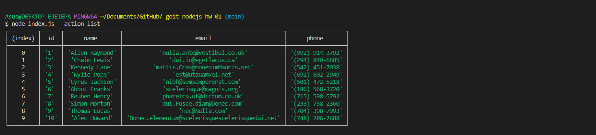

1. Получаем и выводим весь список контактов в виде таблицы (console.table).
node index.js --action list

2. Получаем контакт по id.
node index.js --action get --id 5

3. Добавялем контакт.
node index.js --action add --name Mango --email mango@gmail.com --phone 322-22-22

4. Удаляем контакт.
node index.js --action remove --id 3
